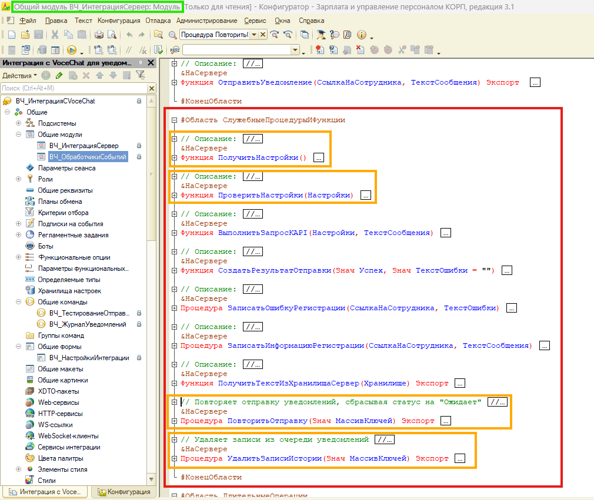

# 🏗️ Архитектурное решение: Журнал уведомлений

**Подсистема:** «ВЧ_ИнтеграцияСМессенджером»  
**Дата:** 27.04.2026  
**Версия:** 1.1 
**Статус:** ✅ Утверждено

**Связанные документы:**
- [📋 Бизнес-требования](05_JOURNAL_REQUIREMENTS.md)
- [📘 Техническая спецификация](07_TECHNICAL_SPECIFICATION_JOURNAL.md)
- [🔧 Руководство администратора](04_ADMIN_GUIDE.md)
- [🔧 Заполнение исторических данных](historical-data-filling-manual.md)

## 📖 Содержание <a name="-содержание"></a>
- [🏗️ Архитектурное решение: Журнал уведомлений](#️-архитектурное-решение-журнал-уведомлений)
  - [📖 Содержание ](#-содержание-)
  - [1. Контекст и цели ](#1-контекст-и-цели-)
  - [2. Архитектурные ограничения ](#2-архитектурные-ограничения-)
  - [3. Бизнес-контекст архитектурных решений ](#3-бизнес-контекст-архитектурных-решений-)
  - [4. Принятые архитектурные решения ](#4-принятые-архитектурные-решения-)
    - [4.1. Тип объекта: Обработка (не ОбщаяФорма)](#41-тип-объекта-обработка-не-общаяформа)
    - [4.2. Источник данных: Запрос + Выгрузить()](#42-источник-данных-запрос--выгрузить)
    - [4.3. Кнопки управления: Вынесены в общий модуль](#43-кнопки-управления-вынесены-в-общий-модуль)
    - [4.3. Кнопки управления: Вынесены в общий модуль](#43-кнопки-управления-вынесены-в-общий-модуль-1)
  - [5. Структура формы журнала ](#5-структура-формы-журнала-)
  - [6. Ролевая модель ](#6-ролевая-модель-)
    - [6.1. Роли и права](#61-роли-и-права)
    - [6.2. Реализация: отбор в запросе (не в метаданных)](#62-реализация-отбор-в-запросе-не-в-метаданных)
  - [7. Навигация и интеграция ](#7-навигация-и-интеграция-)
    - [7.1. Точки входа в журнал](#71-точки-входа-в-журнал)
    - [7.2. Передача параметров из документа](#72-передача-параметров-из-документа)
    - [7.3. Переход к документу из журнала](#73-переход-к-документу-из-журнала)
  - [8. Нефункциональные требования ](#8-нефункциональные-требования-)
    - [8.1. Производительность](#81-производительность)
    - [8.2. Безопасность](#82-безопасность)
  - [9. Точки расширения ](#9-точки-расширения-)
  - [10. Особенности реализации ](#10-особенности-реализации-)
    - [10.1. Заполнение исторических данных... ](#101-заполнение-исторических-данных-)
    - [10.2. Оптимизация отображения `ИДСообщения` ](#102-оптимизация-отображения-идсообщения-)
    - [10.3. Контекстный переход из документа «Прием на работу» ](#103-контекстный-переход-из-документа-прием-на-работу-)
  - [11. Критерии приёмки архитектуры ](#11-критерии-приёмки-архитектуры-)

---

## 1. Контекст и цели <a name="1-контекст-и-цели"></a>

Журнал уведомлений — это инструмент визуального контроля и управления очередью сообщений, отправляемых из 1С:ЗУП 3.1 в корпоративный мессенджер VoceChat.

**Цели архитектурного решения:**
| Цель | Метрика успеха |
|:---|:---|
| Прозрачность процесса | Кадровик видит статус менее, чем за 10 сек |
| Контроль для администратора | Единый журнал со всеми записями, фильтрами, действиями |
| Безопасность | Кадровик не видит чужие документы (ролевая модель) |
| Расширяемость | Возможность добавить новые типы уведомлений через доработку общих модулей |

[🔝 Наверх](#-архитектурное-решение-журнал-уведомлений)

---

## 2. Архитектурные ограничения <a name="2-архитектурные-ограничения"></a>

| Ограничение | Влияние на решение |
|:---|:---|
| **Типовая ЗУП 3.1** | Нельзя менять метаданные конфигурации → расширение, а не встраивание |
| **Управляемые формы** | Клиент-серверное взаимодействие, асинхронные оповещения |
| **Регистр сведений** | Периодический (в пределах секунды), независимый → запросы с отборами, индексы по измерениям |
| **Производительность** | ≤ 1000 записей/день → запрос + `Выгрузить()` достаточно, СКД отложен |

[🔝 Наверх](#-архитектурное-решение-журнал-уведомлений)

---

## 3. Бизнес-контекст архитектурных решений <a name="3-бизнес-контекст-архитектурных-решений"></a>

Архитектурные выборы сделаны в ответ на конкретные потребности бизнеса. Ниже — соответствие требований и решений.

| Бизнес-потребность | Архитектурный выбор | Обоснование |
|:---|:---|:---|
| Журнал должен быть доступен из подсистемы и из формы документа | Обработка с управляемой формой а не общая форма | Не зависит от обновления ЗУП, легче распространять через `.cfe`, не требует прав на изменение конфигурации |
| Массовый выбор записей для операций | Чекбоксы в  + кнопки «Выделить всё»/«Снять» | Надёжнее выделения мышкой при больших списках; предсказуемое поведение; стандартный паттерн 1С |
| Отображение идентификаторов для отладки | Скрыть технические GUID, показать понятные поля (Сотрудник, Документ, Статус) | Бизнесу важнее семантика, чем технический ключ; строковый GUID оставлен для копирования в логи |

> 💡 **Принцип:** Каждое архитектурное решение должно отвечать на вопрос «Какую бизнес-проблему это решает?».


[🔝 Наверх](#-архитектурное-решение-журнал-уведомлений)

---

## 4. Принятые архитектурные решения <a name="4-принятые-архитектурные-решения"></a>

### 4.1. Тип объекта: Обработка (не ОбщаяФорма)

| Критерий | Решение | Обоснование |
|:---|:---|:---|
| Универсальность | ✅ `Обработка.ВЧ_ЖурналУведомлений` | Открывается из любого места: документ, главное меню |
| Переиспользование | ✅ Одна форма для всех ролей | Логика отображения/прав — в модуле формы, не дублируется |
| Тестируемость | ✅ Легко тестировать отдельно | Не зависит от формы документа «ПриемНаРаботу» |
| Обновляемость | ✅ Не ломается при обновлении ЗУП | Расширение документа может «отвалиться» при обновлении вендора |

### 4.2. Источник данных: Запрос + Выгрузить()

| Подход | Почему выбран / отклонён |
|:---|:---|
| ✅ Запрос + `Выгрузить()` | Быстро для ≤ 1000 записей, гибкая фильтрация, просто в отладке |
| ❌ СКД | Избыточно для простой таблицы, сложнее в отладке, отложим на задачу по отчётности |
| ❌ Виртуальная таблица регистра | Не даёт нужной гибкости в отборах и соединениях |

### 4.3. Кнопки управления: Вынесены в общий модуль

### 4.3. Кнопки управления: Вынесены в общий модуль


*Рисунок 1 — структура общего модуля: обработчики команд и служебные процедуры вынесены на сервер*

**Почему так:**
- ✅ Единая точка входа — легче поддерживать
- ✅ Можно вызвать из формы, из РЗ, из внешней обработки
- ✅ Легко покрыть тестами

[🔝 Наверх](#-архитектурное-решение-журнал-уведомлений)

---

## 5. Структура формы журнала <a name="5-структура-формы-журнала"></a>


*Рисунок 2 — структура формы журнала*

**Элементы формы:**
| Элемент | Тип | Назначение |
|:---|:---|:---|
| `ПериодОтбора` | Структура | Параметры периода для запроса |
| `ОтборСтатус`, `ОтборДокумент`, `ОтборСотрудник` | Реквизиты формы | Фильтры с автоподстановкой |
| `СписокЗаписей` | ТаблицаЗначений | Отображение данных регистра |
| `СписокЗаписей.Пометка` | Булево | Чекбокс для массовых операций |
| Кнопки команд | Команды формы | Действия пользователя |

[🔝 Наверх](#-архитектурное-решение-журнал-уведомлений)

---

## 6. Ролевая модель <a name="6-ролевая-модель"></a>

### 6.1. Роли и права

| Роль | Права на РегистрСведений.ВЧ_ОчередьУведомлений | Ограничения |
|:---|:---|:---|
| `ВЧ_АдминистраторИнтеграции` | Чтение, Запись, Удаление | ❌ Нет ограничений |
| `ВЧ_ЧтениеИнтеграции` | Чтение | ✅ Только записи, где `ОтветственныйКадровик` = `ТекущийПользователь()` |

### 6.2. Реализация: отбор в запросе (не в метаданных)

```bsl
Запрос.Текст = "
|ВЫБРАТЬ ...
|ИЗ РегистрСведений.ВЧ_ОчередьУведомлений КАК Очередь
|ГДЕ ...
|   И (Очередь.ОтветственныйКадровик = &ТекущийПользователь ИЛИ &ЭтоАдминистратор)
|...";
<...>
// В модуле формы, при установке параметров запроса
Запрос.УстановитьПараметр("ЭтоАдминистратор", ЭтоАдминистраторИнтеграции());

```
---
```bsl
// Проверяет, является ли текущий пользователь администратором интеграции.
//
// Возвращаемое значение:
//  Булево - Истина, если пользователь имеет административные права
//
Функция ЭтоАдминистраторИнтеграции()
	
	Возврат РольДоступна("ВЧ_АдминистраторИнтеграции") Или РольДоступна("ПолныеПрава");
	
КонецФункции
```

**Почему не RLS в метаданных:**
- ✅ Гибче: можно быстро изменить логику без перепроведения ИБ
- ✅ Проще в отладке: видно в коде, а не в скрытых настройках ролей
- ✅ Достаточно для текущего объёма данных (≤ 1000 записей/день)

[🔝 Наверх](#-архитектурное-решение-журнал-уведомлений)

---

## 7. Навигация и интеграция <a name="7-навигация-и-интеграция"></a>

### 7.1. Точки входа в журнал

| Откуда | Как | Параметры |
|:---|:---|:---|
| Документ «ПриемНаРаботу» | Кнопка в командном интерфейсе формы | `СсылкаНаДокумент` → автопериод + отбор |
| Обработка «ВЧ_НастройкиИнтеграции» | Кнопка в командной панели | Без отборов (полный журнал) |
| Панель разделов подсистемы| Подсистема «Интеграция с мессенджером» → Раздел «Сервис» → Команда «Журнал уведомлений» | Без отборов |

### 7.2. Передача параметров из документа
Общая команда (&НаКлиенте)
```bsl
#Область ПрограммныйИнтерфейс

// Открывает форму журнала уведомлений с передачей ссылки на документ
//
// Параметры:
//  ПараметрКоманды - СсылкаНаДокумент - ссылка на документ (опционально)
//  ПараметрыВыполненияКоманды - Структура - параметры выполнения команды
//
&НаКлиенте
Процедура ОбработкаКоманды(ПараметрКоманды, ПараметрыВыполненияКоманды) Экспорт
	
	ПараметрыОткрытия = ПолучитьПараметрыОткрытияФормы(ПараметрКоманды, ПараметрыВыполненияКоманды);
	
	ОткрытьФорму(
		"Обработка.ВЧ_ЖурналУведомлений.Форма.ВЧ_ЖурналУведомлений",
		ПараметрыОткрытия,
		ПараметрыВыполненияКоманды.Источник,
		ПараметрыВыполненияКоманды.Уникальность,
		ПараметрыВыполненияКоманды.Окно);
	
КонецПроцедуры

#КонецОбласти

#Область СлужебныеПроцедурыИФункции

// Возвращает структуру параметров для открытия формы журнала уведомлений
//
// Параметры:
//  ПараметрКоманды - Произвольный - параметр команды
//  ПараметрыВыполненияКоманды - Структура - параметры выполнения команды
//
// Возвращаемое значение:
//  Структура - параметры для открытия формы
//
&НаКлиенте
Функция ПолучитьПараметрыОткрытияФормы(ПараметрКоманды, ПараметрыВыполненияКоманды)
	
	ПараметрыОткрытия = Новый Структура;
	СсылкаНаДокумент = ОпределитьСсылкуНаДокумент(ПараметрКоманды, ПараметрыВыполненияКоманды.Источник);
	
	Если СсылкаНаДокумент <> Неопределено Тогда
		ПараметрыОткрытия.Вставить("СсылкаНаДокумент", СсылкаНаДокумент);
	КонецЕсли;
	
	Возврат ПараметрыОткрытия;
	
КонецФункции
<...>
#КонецОбласти
```
---
Форма журнала (&НаСервере):
```bsl
// Настраивает отбор по документу, если форма открыта из команды документа.
//
&НаСервере
Процедура НастроитьОтборПоДокументу()
	
	Если НЕ Параметры.Свойство("СсылкаНаДокумент") Или Параметры.СсылкаНаДокумент = Неопределено Тогда
		Возврат;
	КонецЕсли;
	
	СсылкаНаДокумент = Параметры.СсылкаНаДокумент;
	
	Если СсылкаНаДокумент.Метаданные().Имя <> "ПриемНаРаботу" Тогда
		Возврат;
	КонецЕсли;
	
	ПериодОтбора.ДатаНачала = НачалоМесяца(СсылкаНаДокумент.Дата);
	ПериодОтбора.ДатаОкончания = КонецДня(ТекущаяДата());
	ОтборДокумент = СсылкаНаДокумент;
	
КонецПроцедуры
```

### 7.3. Переход к документу из журнала

```bsl
// Открывает документ-основание для выбранной записи журнала.
//
// Параметры:
//  Команда - КомандаФормы - команда, вызвавшая обработчик
//
&НаКлиенте
Процедура ПерейтиКДокументу(Команда)
	
	ТекущиеДанные = Элементы.СписокЗаписей.ТекущиеДанные;
	
	Если ТекущиеДанные = Неопределено Тогда
		ПоказатьПредупреждение(, "Выберите строку журнала для перехода к документу.");
		Возврат;
	КонецЕсли;
	
	ДокументСсылка = ТекущиеДанные.ДокументОснование;
	
	Если ДокументСсылка = Неопределено Или ДокументСсылка.Пустая() Тогда
		ПоказатьПредупреждение(, "В выбранной записи не указан документ-основание.");
		Возврат;
	КонецЕсли;
	
	ПоказатьЗначение(, ДокументСсылка);
	
КонецПроцедуры
```

[🔝 Наверх](#-архитектурное-решение-журнал-уведомлений)

---

## 8. Нефункциональные требования <a name="8-нефункциональные-требования"></a>

### 8.1. Производительность

| Период | Оценочное количество записей | Комментарий |
|:---|:---|:---|
| 1 день | ≤ 50 | Средний отдел кадров |
| 1 неделя | ≤ 300 | Пиковая нагрузка |
| 1 месяц | ≤ 1 200 | Максимум для текущей инфраструктуры |

**Оптимизация запроса:**
- Индексы регистра создаются автоматически по измерениям и периодам
- Запрос формируется динамически с отборами по форме
- Используется пакетная обработка при заполнении истории (100-500 записей за транзакцию)
- Фоновое задание не блокирует интерфейс пользователя

### 8.2. Безопасность

- ✅ Все серверные процедуры помечены `&НаСервере`
- ✅ Проверка прав перед выполнением опасных операций (удаление)
- ✅ Логирование действий в `ЖурналРегистрации` (для аудита)

[🔝 Наверх](#-архитектурное-решение-журнал-уведомлений)

---

## 9. Точки расширения <a name="9-точки-расширения"></a>

| Точка | Как расширить | Пример |
|:---|:---|:---|
| Новый тип уведомления | Добавить значение в `Перечисление.ВЧ_ТипыУведомлений` + обработчик в `ВЧ_ОбработчикиСобытий` | Уведомление об увольнении |
| Новый канал отправки | Изменить константу `ВЧ_IDКанала` + доработать `ВЧ_ИнтеграцияСервер.ОтправитьУведомление()` | Telegram (требуется доработка) |
| Дополнительный отбор | Добавить реквизит в форму журнала + параметр в запрос `СоздатьЗапросДанных()` | По сотруднику, по документу |

[🔝 Наверх](#-архитектурное-решение-журнал-уведомлений)

---

## 10. Особенности реализации <a name="10-особенности-реализации"></a>

В процессе разработки были выявлены системные особенности, потребовавшие дополнительных архитектурных решений.

### 10.1. Заполнение исторических данных... <a name="101-заполнение-исторических-данных"></a>

**Контекст:**
При добавлении ресурса `Сотрудник` в регистр `ВЧ_ОчередьУведомлений` (версия v2.1.0 и новее) старые записи остались с пустым значением, что ломало фильтры и аналитику.

**Проблема:**
- Пользователь не должен замечать изменений после обновления.
- Массовое обновление «в лоб» могло заблокировать базу.
- Ручная миграция — небезопасна и не масштабируема.

**Решение:**
Фоновая обработка `ВЧ_ПерезаполнениеСотрудникаВРегистреУведомлений`:

| Характеристика | Значение | Обоснование |
|:---|:---|:---|
| Режим | `ДлительныеОперации` | Не блокирует интерфейс |
| Пакетная фиксация | 100–500 записей/транзакция | Снижает нагрузку на СУБД |
| Прогресс/лог | Форма + Журнал регистрации | Прозрачность для админа |
| Идемпотентность | Заполняет только пустые поля | Безопасный повторный запуск |
| Доступ | Только `ВЧ_АдминистраторИнтеграции` | Исключает случайный запуск |

**Результат для бизнеса:**
- ✅ Кадровик не замечает изменений: фильтры работают одинаково для новых и старых записей.
- ✅ Администратор получает инструмент с контролем выполнения.
- ✅ База не «ложится» при обновлении.

**Технический долг:**
- ⚠️ Нет отката изменений (требуется ручной запрос к регистру).
- ⚠️ При >10 000 записей может потребоваться увеличение времени выполнения.

---

### 10.2. Оптимизация отображения `ИДСообщения` <a name="102-оптимизация-отображения-идсообщения"></a>

**Контекст:**
Поле типа `УникальныйИдентификатор` не отображалось корректно в таблице значений управляемой формы.

**Решение:**
Приведение в запросе: `СТРОКА(ИДСообщения) КАК ИДСообщения` + тип колонки `Строка(36)` на форме.

**Результат:**
- ✅ Стабильное отображение в журнале.
- ✅ Упрощённая отладка (строковый GUID легче копировать).
- ✅ Совместимость с веб-клиентом (корректная сериализация в JSON).

---

### 10.3. Контекстный переход из документа «Прием на работу» <a name="103-контекстный-переход-из-документа"></a>

**Контекст:**
Пользователь ожидает увидеть только уведомления, связанные с текущим документом, за соответствующий период.

**Проблема:**
- Чтение реквизитов документа на клиенте может вызывать ошибки.
- Прямая передача параметров требует обработки разных контекстов.

**Решение:**
1. **На клиенте** (общая команда): передаём только `СсылкаНаДокумент` через `Источник.Параметры.Ключ`.
2. **На сервере** (форма журнала): читаем `СсылкаНаДокумент.Дата` и устанавливаем период + отбор.

**Результат:**
- ✅ Стабильная работа из любого контекста.
- ✅ Автоматическая установка периода месяца документа.
- ✅ Автоматический отбор по документу-основанию.

[🔝 Наверх](#-архитектурное-решение-журнал-уведомлений)

---

## 11. Критерии приёмки архитектуры <a name="11-критерии-приёмки-архитектуры"></a>

| № | Критерий | Как проверим |
|:---|:---|:---|
| **А-1** | Форма открывается без ошибок | `ОткрытьФорму("Обработка.ВЧ_ЖурналУведомлений.Форма")` |
| **А-2** | Кадровик не видит чужие записи | Войти под тестовым пользователем, проверить выборку |
| **А-3** | Администратор видит все записи | Войти под админом, проверить отсутствие отборов |
| **А-4** | Кнопка «Повторить» меняет статус | Вызвать команду, проверить изменение в регистре |
| **А-5** | Переход к документу работает | Нажать на ссылку, убедиться, что форма документа открылась |

---

[🔝 Наверх](#-архитектурное-решение-журнал-уведомлений)