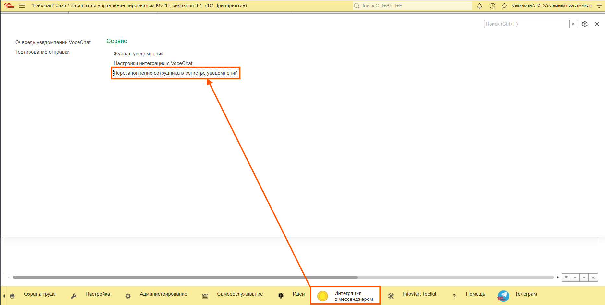
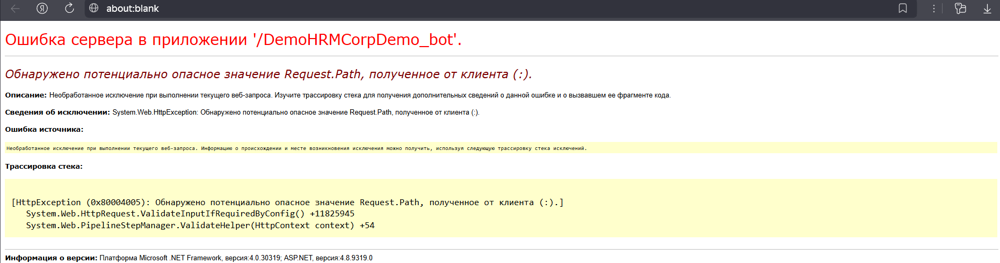

# Руководство: Заполнение сотрудников в регистре уведомлений

> **Файл:** `docs/employee-filling-manual.md`  
> **Версия:** 1.0  
> **Обновлено:** 2026-05-01  
> **Для кого:** Администраторы 1С, разработчики расширений

---

## 🔍 Назначение

Обработка `ВЧ_ПерезаполнениеСотрудникаВРегистреУведомлений` выполняет заполнение исторических данных: добавляет значение в поле `Сотрудник` для записей регистра `ВЧ_ОчередьУведомлений`, созданных до появления этого ресурса. Данные извлекаются из связанных документов «Прием на работу».

**Когда использовать:**
- ✅ После обновления расширения до версии с новым ресурсом `Сотрудник` (≥ v2.1.0)
- ✅ Для инициализации пустых значений в уже существующих записях регистра
- ✅ Для корректной работы фильтрации, отчётов и аналитики по сотруднику

---

## ⚙️ Требования и ограничения

| Параметр | Значение |
|----------|----------|
| Платформа 1С | 8.3.20+ |
| Конфигурация | ЗУП 3.1 (ред. 3.1.хх) |
| Расширение | `ВЧ_ИнтеграцияСVoceChat` ≥ v2.1.0 |
| Права пользователя | Роль `ВЧ_АдминистраторИнтеграции` или `ПолныеПрава` |
| Путь в интерфейсе | Подсистема «Интеграция с мессенджером» → Раздел «Сервис» |
| Блокировки | Не блокирует работу пользователей (пакетная фиксация транзакций) |
| RLS | Учитывает ограничения по `ОтветственныйКадровик` (для полного заполнения запускать от администратора) |

---

## 🚀 Быстрый старт (для опытных)

```
1. Подсистема "Интеграция с мессенджером" → Сервис → Заполнение сотрудника...
2. Параметры: Отладка=0, Пакет=100, Лог=1
3. Нажать "Заполнить сотрудников в истории"
4. Контроль: Журнал регистрации → Событие "ВЧ_ЗаполнениеСотрудников"
5. Результат: надпись на форме + запись в ЖР "Заполнение завершено"
```

---

## 📋 Пошаговая инструкция

### Шаг 1. Откройте обработку

Обработка доступна только администраторам интеграции в разделе "Сервис".

**Путь:**
```
Подсистема "Интеграция с мессенджером" 
  → Раздел "Сервис" 
    → Ссылка "Перезаполнение сотрудника в регистре уведомлений"
```



*Рисунок 1 — Расположение обработки в разделе "Сервис"*

> ⚠️ **Важно:** Если вы не видите эту ссылку, убедитесь, что у вашего пользователя есть роль `ВЧ_АдминистраторИнтеграции`. Обычные кадровики эту обработку не видят.

---

### Шаг 2. Настройте параметры

На форме доступны три управляющих параметра:

| Параметр | Тип | По умолчанию | Описание |
|----------|-----|--------------|----------|
| Количество строк для отладки | Число | `0` | `0` = все записи; `>0` = обработать только первые N (для безопасного теста) |
| Пакетный лимит | Число | `100` | Записей в одной транзакции. Больше = быстрее, но выше нагрузка на СУБД |
| Интервал логирования | Число | `1` | Писать в Журнал регистрации каждый N-й пакет. `1` = каждый пакет |

#### 🎯 Рекомендованные настройки

| Сценарий | Отладка | Пакет | Лог |
|----------|---------|-------|-----|
| Тест (10-20 записей) | `10` | `2` | `1` |
| Продакшн (<1000 записей) | `0` | `100` | `1` |
| Продакшн (≥1000 записей) | `0` | `500` | `10` |

---

### Шаг 3. Запустите обработку

1. Нажмите кнопку «Заполнить сотрудников в истории»
2. ⚠️ Окно не откроется — выполнение идёт в фоновом режиме. Вы можете продолжать работать в 1С.
3. Кнопка «Отмена выполнения» становится активной на время работы фонового задания (Функционал отмены реализован на уровне платформы 1С через механизм ДлительныеОперации).

---

### Шаг 4. Контроль выполнения

#### 🔍 Способ 1: Журнал регистрации (рекомендуется)

```
Администрирование → Журнал регистрации → [Фильтр]
• Событие = "ВЧ_ЗаполнениеСотрудников"
• Уровень = Информация, Ошибка
```

**Ожидаемые записи:**
```
[Информация] Начало заполнения. Всего записей: 100, пакет: 100
[Информация] Пакет 1: обработано 100, записано 98, ошибок 2. Записи: [GUID-1, ...]
[Информация] Заполнение завершено. Пакетов: 1, Всего записано: 98, Ошибок: 2
```

#### 🔍 Способ 2: Фоновые задания

```
Администрирование → Фоновые задания
• Имя: "Заполнение сотрудников в очереди уведомлений"
• Статус: Активно → Завершено
```

> ⚠️ Если задание в статусе «Ошибка» — см. раздел «Типовые ошибки».

---

### Шаг 5. Результат

После завершения на форме появится надпись:

```
✅ Заполнено записей: 98; Ошибок при обработке: 2
```

| Поле | Значение |
|------|----------|
| Заполнено записей | Успешно инициализированные строки регистра |
| Ошибок при обработке | Записи, где не удалось извлечь сотрудника (документ удалён, не проведён, ошибка доступа) |

---

## 🔧 Типовые ошибки и решения

### Ошибка в веб-клиенте: "Потенциально опасное значение Request.Path"



*Рисунок 2 — Ошибка при открытии обработки в опубликованной базе в веб-браузере*

**Симптомы:**

При открытии обработки в веб-клиенте браузер показывает ошибку сервера:
```
Ошибка сервера в приложении '/DemoHRMCorpDemo_bot'.
Обнаружено потенциально опасное значение Request.Path, полученное от клиента (:).
System.Web.HttpException: Обнаружено потенциально опасное значение Request.Path...
```

**Причина:**

ASP.NET/IIS по умолчанию блокирует символы вроде `:` в URL. Платформа 1С использует их в параметрах веб-запросов, что вызывает срабатывание встроенной защиты.

**Решение:**

1. Откройте файл `web.config` в каталоге публикации базы:
   `C:\inetpub\wwwroot\DemoHRMCorpDemo_bot\web.config`
2. Замените содержимое файла на актуальный синтаксис:
   ```xml
   <?xml version="1.0" encoding="UTF-8"?>
   <configuration>
       <system.web>
           <!-- ✅ РАЗРЕШАЕМ ВСЕ СПЕЦИАЛЬНЫЕ СИМВОЛЫ В URL -->
           <httpRuntime requestPathInvalidCharacters="" />
       </system.web>
       <system.webServer>
           <handlers>
               <add name="1C Web-service Extension" path="*" verb="*" modules="IsapiModule" scriptProcessor="E:\DEV_LOCAL\INSTALLED\1cv8\8.5.1.1150\bin\wsisapi.dll" resourceType="Unspecified" requireAccess="None" />
           </handlers>
       </system.webServer>
   </configuration>
   ```
3. Сохраните файл.
4. Перезапустите IIS (команда `iisreset`) ИЛИ просто перезайдите в веб-клиент (в большинстве случаев достаточно повторного входа в сессию, перезапуск IIS не обязателен).

> ⚠️ **Важно:** Это стандартная настройка для веб-публикаций 1С. Параметр отключает фильтрацию опасных символов в пути запроса. Убедитесь, что публикация защищена VPN (Tailscale) или находится во внутренней сети.

---

### Другие типовые ошибки

| Ошибка | Причина | Решение |
|--------|---------|---------|
| `Обработка не видна в списке` | Нет прав / расширение не подключено | Проверить роль `ВЧ_АдминистраторИнтеграции` |
| `Записано: 0, ошибок: 0` | Нет записей с пустым `Сотрудник` | Проверить отбор в регистре или запустить на другой базе |
| `Ошибок > 0` | Документ-основание удалён / не проведён / заблокирован | Проверить Журнал регистрации, при необходимости восстановить документы |
| `Фоновое задание "Ошибка"` | Таймаут транзакции / блокировка БД / нехватка памяти | Уменьшить `Пакетный лимит`, запустить повторно |
| `Дублирование записей в ЖР` | Повторный запуск обработки | Нормально: обработка идемпотентна, уже заполненные записи пропускаются |

---

## ♻️ Повторный запуск и сброс

### Можно ли запустить повторно?

✅ **Да.** Обработка заполняет только пустые поля. Уже заполненные записи не изменяются и не дублируются.

### Можно ли прервать?

✅ **Да.** Закройте форму или нажмите «Отмена». Незавершённый пакет будет отменён. При повторном запуске обработка продолжится с первой необработанной записи.

### Что если нужно сбросить заполненные значения?

⚠️ **Прямого отката в интерфейсе нет.** Для очистки поля `Сотрудник` у исторических записей:

1. Выполните запрос к регистру `ВЧ_ОчередьУведомлений` через Консоль запросов или внешнюю обработку
2. Очистите поле `Сотрудник` у нужных записей (присвойте `ПустаяСсылка()`)
3. Запустите обработку заполнения заново

> 💡 Рекомендуется протестировать на копии базы перед массовым заполнением в продакшне.

---

## 🔐 Безопасность и RLS

- Доступ к обработке имеет только администратор интеграции или пользователь с полными правами.
- Фоновое задание использует пакетную фиксацию транзакций, что минимизирует риск блокировок и потери данных при сбоях.

---

> 💡 **Совет:** Сохраните эту инструкцию в базе знаний команды. При следующем обновлении функционала инициализации — актуализируйте документ.